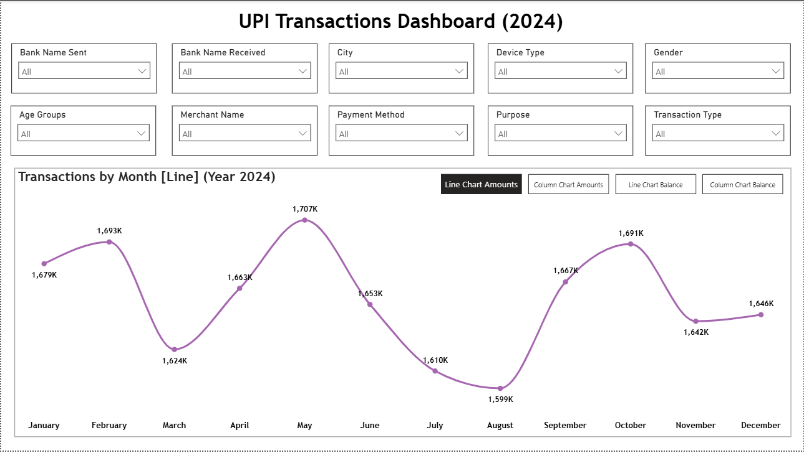
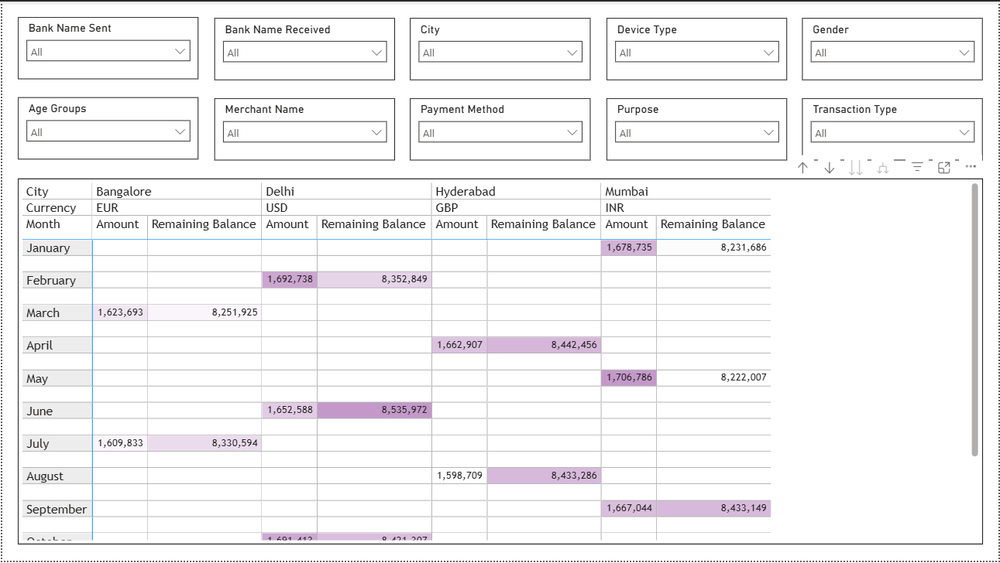

# UPI Transactions — Power BI Dashboard (2024)

**Analyst:** Nwankwo Emmanuel  
**Tool:** Microsoft Power BI Desktop  
**Data:** UPI_Transactions.xlsx  
**Records:** 20,000 transactions | Year 2024  
**Portfolio:** [View Full Portfolio](https://www.notion.so/Emmanuel-Nwankwo-Data-AI-Automation-Portfolio-34d2848d0dba80bd9f6fc5fd419f3c63)  
**GitHub:** [github.com/Emmapluz](https://github.com/Emmapluz)  
**LinkedIn:** [Nwankwo Emmanuel](https://www.linkedin.com/in/emmanuel-uchenna-nwankwo)

---

## Dashboard Preview

**Page 1 — Transactions Overview**


**Page 2 — Matrix Analysis**


---

## Project Overview

An interactive two-page Power BI dashboard built on 20,000 UPI digital payment transactions across four Indian cities 
in 2024. The project demonstrates advanced Power BI features including bookmarks for dynamic chart switching, sync slicers 
across multiple pages, conditional formatting and Power BI Service publishing.

This is the third Power BI project in my data analyst portfolio — the most technically advanced, featuring bookmark 
navigation, synced slicers and conditional matrix formatting.

---

## Dataset

| Column | Description |
|---|---|
| TransactionID | Unique transaction identifier |
| TransactionDate | Date of transaction |
| Amount | Transaction amount |
| BankNameSent | Bank sending the payment |
| BankNameReceived | Bank receiving the payment |
| RemainingBalance | Customer balance after transaction |
| City | City of transaction |
| Gender | Customer gender |
| TransactionType | Transfer or Payment |
| Status | Success or Failed |
| TransactionTime | Time of transaction |
| DeviceType | Tablet, Laptop or Mobile |
| PaymentMethod | Phone Number, QR Code or UPI ID |
| MerchantName | Amazon, Zomato, Swiggy, IRCTC, Flipkart |
| Purpose | Food, Travel, Bill Payment, Shopping, Others |
| CustomerAge | Age of customer (20-59) |
| PaymentMode | Instant or Scheduled |
| Currency | USD, EUR, GBP or INR |
| CustomerAccountNumber | Customer account reference |
| MerchantAccountNumber | Merchant account reference |

---

## Data Snapshot

Total transactions: 20,000
Transaction status:
→ Success: 16,000 (80%)
→ Failed: 4,000 (20%)

Transaction types:
→ Transfer: 10,000 (50%)
→ Payment: 10,000 (50%)

Cities:
→ Delhi, Bangalore,
Hyderabad, Mumbai
(5,000 each)

Banks:
→ SBI, ICICI, Axis, HDFC
(5,000 each)

Amount range: $0.05 to $1,999.87
Total amount: $19,872,274
Average: $993.61
Customer age: 20 to 59 years

---

## DAX Calculated Column

Age Groups column created using nested 
IF in DAX:

```dax
Age Groups = 
IF(
    'UPI Transactions'[CustomerAge] <= 25, 
    "A1",
    IF(
        'UPI Transactions'[CustomerAge] <= 35, 
        "A2",
        "A3"
    )
)
```

A1: Age 20-25 (Young customers)
A2: Age 26-35 (Mid-age customers)
A3: Age 36-59 (Senior customers)

---

## Report Pages

**Page 1 — Transactions Overview**

10 dropdown slicers across two rows:
Bank Name Sent, Bank Name Received, 
City, Device Type, Gender, Age Groups,
Merchant Name, Payment Method, 
Purpose, Transaction Type

4 bookmark views via navigator button:
- Line Chart Amounts
- Column Chart Amounts
- Line Chart Balance
- Column Chart Balance

Report-level currency filter (all pages)

**Page 2 — Matrix Analysis**

Same 10 slicers (synced from Page 1)

Matrix visual showing:
- Rows: Month
- Columns: City → Currency
- Values: Amount + Remaining Balance
- Conditional formatting (purple gradient)
  applied to both value columns

---

## Advanced Features Used

✅ Bookmarks (4 bookmarks)
✅ Bookmark Navigator button
✅ Selection Pane management
✅ Sync Slicers across pages
✅ Report-level filters
✅ Conditional formatting (matrix)
✅ DAX calculated column
✅ Data profiling (Power Query)
✅ Mathematical slicer positioning
✅ Published to Power BI Service

---

## Key Findings

**Finding 1 — 20% transaction failure rate**
4,000 out of 20,000 transactions failed 
to complete, which is a significant operational 
signal for any payment platform.

**Finding 2 — Seasonal transaction pattern**
Transaction amounts peak in May (1,707K) 
and dip in August (1,599K). This shows a clear 
seasonal pattern in payment behaviour.

**Finding 3 — City-currency mapping**
Each city processes transactions primarily 
in one currency — Bangalore in EUR, 
Delhi in USD, Hyderabad in GBP, 
Mumbai in INR.

**Finding 4 — Balanced platform distribution**
Equal splits across banks, devices, 
payment methods and purposes suggest 
a mature, well-distributed payment 
ecosystem.

---

## Project Files

upi-transactions-powerbi-dashboard/
├── UPI_Transactions_Dashboard.pbix
├── UPI_Transactions.xlsx
├── screenshots/
│ ├── upi_dashboard_page1.png
│ └── upi_dashboard_page2.png
└── README.md

---

## Related Portfolio Projects

| Project | Tool | Link |
|---|---|---|
| Nigeria Health EDA | Python | [View](https://github.com/Emmapluz/nigeria-health-analysis) |
| Dangote Cement Financials | Excel | [View](https://github.com/Emmapluz/dangote-cement-financial-analysis) |
| Nigeria Health SQL Analysis | SQL Server | [View](https://github.com/Emmapluz/nigeria-health-sql-analysis) |
| ElectroHub Sales Dashboard | Power BI | [View](https://github.com/Emmapluz/electrohub-powerbi-sales-dashboard) |
| Prism Insurance Dashboard | Power BI + Python | [View](https://github.com/Emmapluz/prism-insurance-powerbi-dashboard) |

---

## About the Analyst

Health educator transitioning into data 
analysis and AI automation. Background 
in health education (B.Ed., University 
of Uyo) and fintech operations 
(Moniepoint Microfinance Bank). 
Building expertise in Python, SQL, 
Power BI, Excel and n8n AI automation 
with a focus on health and finance.

Certified Financial Analyst — 
365 Careers, Udemy (December 2025)

- 📍 Lagos, Nigeria
- 💼 [LinkedIn](https://www.linkedin.com/in/emmanuel-uchenna-nwankwo)
- 🗂️ [Portfolio](https://www.notion.so/Emmanuel-Nwankwo-Data-AI-Automation-Portfolio-34d2848d0dba80bd9f6fc5fd419f3c63)
- 💻 [GitHub](https://github.com/Emmapluz)
- 📖 [Medium](https://medium.com/@e.u.nwankwo93)
